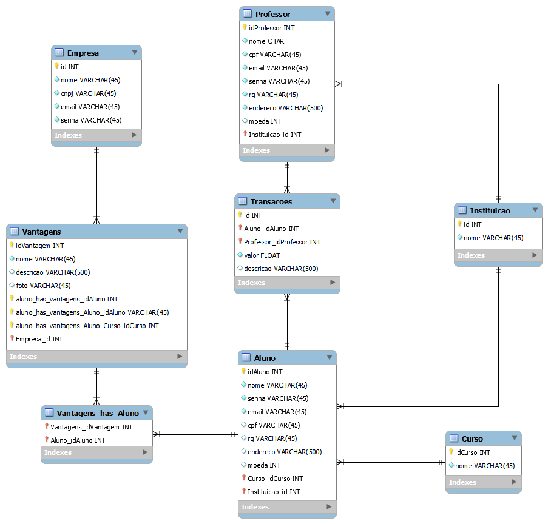
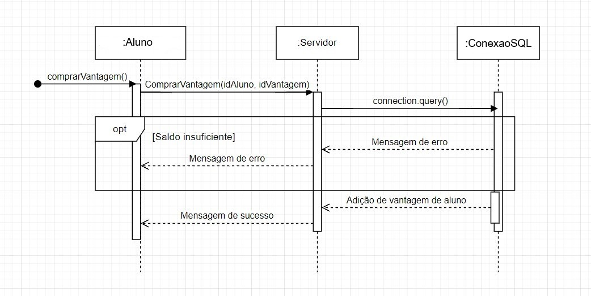

# Artefatos do projeto

Este diretório mantém os artefatos do projeto. 

Os artefatos do projeto estão separados da seguinte forma:
* `/Caso de Uso`
	* **Sistema de Moeda Estudantil.asta**: Projeto feito no Astah do diagrama de casos de uso.
   
   

* `/Diagrama de Classe`
	* **Diagrama de classe.asta**: Projeto feito no Astah do diagrama de casos de uso.
   
   

* `/Diagrama de banco de dados`
	* **moedaEstudantil.mwb**: Projeto feito no MySQL Workbench do diagrama lógico de entidade e relacionamento.
   
   

* `/Diagramas de sequencia`
	* **Realizar tranferencia.asta**: Diagrama de realização de transferência.
   
   
  
	* **moedaEstudantil_DSS_CriarVantagem.asta**: Diagrama de criação de vantagem.
   
   
  
	* **moedaEstudantil_DSS_Extrato.asta**: Diagrama de visualização de extrato.
   
   
  
	* **moedaEstudantil_DSS_ViewVantagem.asta**: Diagrama de visualização de vantagem.
   
   
  
	* **SequenceDiagramComprarVantagem.drawio**: Diagrama de compra de vantagem.
   
   

* `/Historia de usuário`
	* **backlog.md**: Descrição das histórias de usuário de acordo com os casos de uso.
 
| Usuário      | Requisito | Motivação     |Autor     |Status     |
| :----:        |    :----:   |          :----: |           :----: |            :----: |
Como um usuário ou empresa, eu quero| entrar no sistema | para ter meus dados salvos	 | Amanda Moura | Pendente |
Como um aluno ou empresa, eu quero| realizar cadastro	 | para ter acesso as funcionalidades do programa	 | Giovanni Duarte | Pendente |
Como um usuário, eu quero| ver extrato | para ver o total de moedas que ainda possui, bem como as transações que realizei | Guilherme Drumond | Pendente |
Como um professor, eu quero| enviar moedas | para recompensar o bom comportamento e participação em aula de meus alunos | Luiz Gustavo	 | Pendente |
Como um empresa, eu quero| cadastrar as vantagens | para que o aluno gaste as moedas dele comigo | Pedro Ramos Vidigal | Pendente |
Como um aluno, eu quero| trocar moedas | para receber uma vantagen escolhida no sistema | Vitor Nunes Calhau | Pendente |

* `/Imagens`
	* Arquivo contendo todas as imagens utilizadas.

* `/Videos`
	* Arquivo contendo todos os vídeos realizados.
